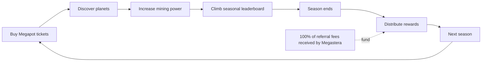

<div align="center">
  <h1>Megastera</h1>
  <p><strong>A space tycoon built around Megapot. Buy a ticket, discover a planet, grow your mining power, and compete for seasonal rewards.</strong></p>
  <p>
    <a href="https://megastera.vercel.app"></a>
    <a href="https://x.com/MegasteraGame"></a>
    <a href="https://x.com/AstralEX163/status/2088334372063654047"></a>
  </p>
</div>


<div align="center">
  
</div>


<div align="center">
  <p><strong>Buy a Megapot ticket → discover a planet → increase mining power → climb the leaderboard → earn seasonal rewards.</strong></p>
  <p>
    <a href="#how-it-works">How it works</a> ·
    <a href="#planets--mining">Planets &amp; mining</a> ·
    <a href="#seasons--rewards">Seasons &amp; rewards</a> ·
    <a href="#why-megapot-is-core">Why Megapot is core</a> ·
    <a href="#architecture">Architecture</a> ·
    <a href="#run-locally">Run locally</a>
  </p>
</div>

Megastera turns every Megapot ticket into persistent game progression.

A player enters through the same action they would already take in Megapot: purchasing a real ticket on **Base mainnet**. Once the purchase is confirmed, Megastera verifies the onchain receipt and deterministically generates a planet from that ticket's provenance. The ticket still participates in the Megapot jackpot, while the planet becomes part of the player's long-term collection.

One purchase therefore creates two simultaneous experiences: **jackpot anticipation** and **game progression**.

## How it works

1. **Play.** Connect a wallet and choose an expedition size and ticket coordinates.
2. **Buy a Megapot ticket.** The game uses the actual Megapot ticket flow rather than a separate game-only purchase.
3. **Reveal a planet.** The confirmed ticket becomes immutable provenance for a procedurally generated world.
4. **Mine minerals.** Every planet has its own mining rate and continuously contributes to the wallet's total production.
5. **Build a collection.** Additional tickets create additional planets with different types, rarities and visual traits.
6. **Compete.** Total mining power determines leaderboard performance during the season.
7. **Finish the season.** Final leaderboard standings determine reward distribution, then the next season begins.

The underlying Megapot ticket remains active throughout the normal jackpot lifecycle.

## Planets & mining

Every eligible Megapot ticket generates one deterministic planet.

A planet can differ by:

- planet type;
- rarity;
- terrain and palette;
- rings, moons and other satellites;
- visual appearance;
- mineral production rate;
- generated name and other deterministic traits.

The most important gameplay stat is **minerals per day**. A planet's mining rate contributes directly to the player's total mining power.

If a wallet owns multiple planets, their production is combined into a single score. A collection might therefore produce, for example, **474 minerals/day** across all of its planets.

More planets are useful, but quality matters too. A smaller collection with stronger or rarer planets can compete with a larger collection of weaker worlds.

### Coordinates and the bonus ball

Players can choose ticket coordinates before purchase. The Megapot bonus ball influences the planet type generated from that ticket, but does not guarantee it.

The current planet configuration gives the bonus-ball-associated type a strong probability bias — roughly half of the outcome distribution — while leaving enough randomness for the reveal to remain uncertain.

That creates another layer of anticipation on top of the ticket purchase: players are not only waiting for the Megapot result, they are also discovering **what kind of planet they received and how strong it is**.

## Seasons & rewards

Megastera is organized around **seasons** rather than an endless leaderboard.

Each season has a clear competitive window. Players know when the race starts, when standings are finalized, and when rewards are distributed. A new season then creates a natural point for new content, balance changes and mechanics.



### Reward flywheel

Megastera is designed so that activity generated through the game helps fund the competition itself.

**100% of the Megapot referral fees received by Megastera are allocated back to the seasonal leaderboard reward pool.**

That creates a simple flywheel:

**More gameplay → more Megapot activity → more referral fees → larger seasonal reward pool → stronger competition.**

For **Season 1**, leaderboard rewards are distributed manually after final standings are locked. Future seasons are planned to move reward settlement into a smart contract so distribution can happen automatically from finalized leaderboard results.

The automated reward contract is a future upgrade; it is not presented as part of the current Season 1 implementation.

Seasonal rewards can expand beyond monetary payouts over time and may include gameplay assets, planets or other items introduced by future mechanics.

Implementation note: the active backend exposes live standings with a current UTC-day period label and has a separate daily finalization worker for archived rows. Reward settlement is not an automated smart-contract or HTTP path in this repository; the Season 1 countdown and prize copy are presented by the client.

## Why Megapot is core

Megapot is not a secondary widget, a link-out, or an unrelated protocol attached to the game.

**Megapot is the entry point and the progression mechanic.**

A player needs Megapot tickets to:

- discover planets;
- grow a collection;
- increase mining power;
- improve leaderboard position;
- participate in seasonal competition;
- contribute activity to the reward pool;
- retain the original Megapot jackpot exposure.

The ticket receipt is also the provenance used to create the planet. This means the game state originates from the same onchain action that enters the player into Megapot.

Instead of the usual loop:

**Buy ticket → wait for result → win or lose**

Megastera adds a persistent layer:

**Buy ticket → reveal planet → discover traits → increase mining power → grow collection → compete → earn seasonal rewards → continue exploring**

The lottery remains intact; the game adds collection, progression and competition around it.

## Two reasons to play

Megastera connects two overlapping user motivations.

### Game-first players

Some users primarily want to play a tycoon-style collection game. They care about discovering better planets, increasing production, optimizing their account and competing against other wallets.

For them, a Megapot ticket is not only a lottery entry. It is also the action that creates a persistent game object and advances their account.

### Jackpot-first users

Other users primarily want to participate in Megapot.

Megastera gives that same purchase a second reveal loop. In addition to the jackpot outcome, the player gets to discover:

- which planet type they received;
- its rarity;
- its appearance;
- whether it has rings or moons;
- its mining rate;
- how it changes their leaderboard position.

The result is an alternative consumer experience for Megapot that can reach users who may not be attracted by a traditional lottery interface alone.

## Early traction

Megastera already has an active user base of **40+ players** participating in the live ticket-to-planet and leaderboard loop.

## Why players come back

Megastera gives a ticket purchase consequences beyond a single drawing.

- Every eligible ticket can permanently expand a player's collection.
- Every planet can improve total mining production.
- Rarity and trait variation create a discovery loop.
- The leaderboard creates direct competition between wallets.
- Seasonal deadlines give that competition a beginning and an end.
- Referral fees flow back into seasonal rewards.
- A player who gets overtaken has a concrete reason to keep exploring.
- Every new expedition still carries the underlying Megapot jackpot opportunity.

This creates both **collection pressure** and **competitive pressure** without removing the original lottery experience.

## What is implemented

The current product includes:

- wallet connection and Megapot ticket purchasing;
- Base mainnet ticket flow;
- coordinate selection and direct checkout;
- keeper-assisted bulk purchases for 11–50 ticket expeditions, including up to ten selected-coordinate tickets;
- canonical `TicketPurchased` receipt recovery and verification;
- deterministic planet generation from immutable ticket provenance;
- deterministic planet traits and GIF rendering;
- persistent planet and ticket records in PostgreSQL;
- retry-safe pending states while receipts finalize or generation completes;
- `My Planets` collection and ticket status;
- live mineral production with same-type collection bonuses;
- current wallet leaderboard;
- opt-in mineral-economy-v2 spendable balances and persisted per-Planet upgrade primitives;
- Megapot drawing state, ticket history and winnings;
- onchain winnings claim flow after simulation;
- Season 1 leaderboard countdown/prize presentation; manual reward settlement is outside the runtime/API in this repository.

This worktree also contains an opt-in mineral-economy-v2 path. Before the prepared cutover, wallet mining and the current leaderboard use the V1 live calculation. After cutover, the backend reconstructs spendable mineral scores from opening balances, historical production, collection/upgrade rate changes, and persisted upgrade costs. The unauthenticated upgrade endpoint remains server-disabled until owner-bound authorization is implemented.

Planet generation is idempotent and keyed by ticket provenance, so the same valid ticket cannot create duplicate planets through repeated generation requests.

## Architecture


The browser handles interaction, but it is not the authority for planet creation.

- Server-side generation accepts only verified ticket provenance.
- Receipt verification checks canonical onchain event data before generation.
- Planet generation is deterministic and idempotent.
- Conflicting persisted provenance fails closed.
- Mining is derived from persisted planet data rather than mutable browser state.
- Same-type collection bonuses are derived from persisted Planet generation times rather than a browser-owned ledger.
- After the mineral-economy cutover, wallet balances and current leaderboard scores are derived from persisted integer-micro account and upgrade history; V1 remains the pre-cutover fallback.
- Generated GIF bytes are stored with an immutable content hash.
- Server credentials and database secrets never enter the Vite client environment.

Planets are currently persistent game records derived from onchain ticket provenance; discovering one does **not** require a second Planet NFT mint transaction.

For deeper implementation details, see [`docs/ARCHITECTURE.md`](docs/ARCHITECTURE.md), [`docs/OPERATIONS.md`](docs/OPERATIONS.md), and [`api/README.md`](api/README.md).

## Where Megastera goes next

Season 1 establishes the core **Megapot ticket → planet → mining → competition** loop.

Future seasons can expand that foundation with colonies, stars, ships, trading, and deeper player-to-player interaction. This worktree's mineral upgrade path is feature-gated and operator-controlled; it is not a completed reward-system rollout. Existing planets are intended to remain relevant as the universe grows rather than becoming obsolete after a season.

## Repository

```text
MegasteraGame/
├── src/                       # React application and game UI
├── api/                       # Receipt verification, planet API, mining, leaderboard
├── packages/planet-generator # Shared deterministic planet generator
├── prisma/                    # Database schema and migrations
├── server/                    # Server runtime entry points
├── shared/                    # Shared types and utilities
├── public/                    # Brand assets and static files
├── docs/                      # Architecture, operations and safety notes
└── .github/workflows/         # Automated quality gate
```

### Stack

**Frontend:** React 19, TypeScript, Vite, wagmi, viem, RainbowKit<br>
**Protocol:** Megapot on Base<br>
**Backend:** Hono, PostgreSQL, Prisma<br>
**Rendering:** shared deterministic planet generator<br>
**Quality:** Vitest, TypeScript, Biome, GitHub Actions

## Run locally

Requirements: Node.js 22+, pnpm 11+, PostgreSQL, and an RPC endpoint for the configured Base environment.

```bash
pnpm install
pnpm db:generate
pnpm db:validate
pnpm api:server
pnpm dev
```

Copy the required values from [`.env.example`](.env.example) into your local environment before starting the frontend and API.

## Quality gate

Every pull request and push to `main` runs the repository quality gate:

```bash
pnpm db:generate
pnpm db:validate
pnpm lint
pnpm typecheck
pnpm test
pnpm --filter @megaplanets/planet-generator golden
pnpm build
```

## License

See [`LICENSE`](LICENSE) for the repository license and [`packages/planet-generator/THIRD_PARTY_NOTICES.md`](packages/planet-generator/THIRD_PARTY_NOTICES.md) for bundled third-party attribution.
