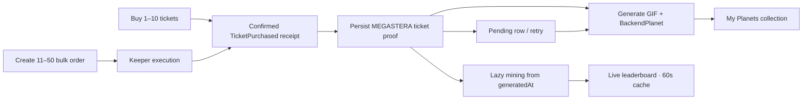

# Megastera

Megastera is a backend-Planet game powered by Megapot tickets on Base mainnet.
Planets are database records rather than NFTs: a finalized canonical ticket receipt creates
one immutable proof, the server renders a deterministic GIF, and My Planets displays the
stored result. Mining is a read-only lifetime calculation.

## Product loop



1. Connect a wallet to Base mainnet.
2. Buy one to ten direct tickets or create an eleven-to-fifty keeper order.
3. The backend waits for the configured confirmation depth, verifies the canonical mainnet
   `MEGASTERA` `TicketPurchased` event, and persists its immutable provenance.
4. Deterministic traits and GIF bytes are stored idempotently in PostgreSQL.
5. My Planets displays generated and retryable pending records; ticket status and winnings
   come from the mainnet Megapot Data API through the same-origin server proxy.

There is no Planet contract call, mint button, voucher signer, Pinata/IPFS upload, direct
ERC-721 holdings read, or continuous ticket indexer in the active runtime.

## Mainnet invariants

- Base mainnet only (`chainId 8453`).
- Jackpot: `0x3bAe643002069dBCbcd62B1A4eb4C4A397d042a2`.
- Batch facilitator: `0xBA343479D98a1Ed333899999D95a7343B808a76F`.
- USDC: `0x833589fCD6eDb6E08f4c7C32D4f71b54bdA02913`.
- Approved referrer: `0x43904de0e226cc20DD72968954af6B439404743D`.
- `MEGASTERA` remains the source tag for direct and bulk purchases.
- Any canonical Base mainnet receipt with the correct jackpot and source is eligible; no
  deploy-time launch-block cutoff is applied.
- Browser RPC and contract writes remain on-chain. Historical ticket data uses
  `https://api.megapot.io/v1` through `/api/megapot`.
- Secrets never use a `VITE_*` name.

## Runtime boundaries

| Boundary | Responsibility |
| --- | --- |
| Megapot + Base RPC | Ticket purchase, live drawing state, claims, receipt finality |
| Vite frontend | Wallet checkout, progress, collection, mining display |
| Vercel Function + Supabase | Data API proxy, proof verification, Planet rows/GIFs, leaderboard |
| Planet generator | DOM-free deterministic traits and GIF rendering |

The Vercel entrypoint is [`api/index.ts`](api/index.ts). Internal backend modules live in
[`server/api`](server/api), so Vercel does not expose each support file as a function.

## Local development

Requirements: Node.js 22+, pnpm, a Base mainnet RPC, and PostgreSQL for live generation.

```bash
pnpm install
pnpm db:generate
pnpm db:validate
pnpm dev
```

Copy `.env.example` to the ignored `.env.local`. The Vite dev server mounts the same Hono
application as Vercel, including `/api/megapot`. See
[`docs/OPERATIONS.md`](docs/OPERATIONS.md) for Supabase migration and Vercel deployment.

## Verification

```bash
pnpm lint
pnpm typecheck
pnpm test
pnpm build
pnpm db:generate
pnpm db:validate
pnpm --filter @megaplanets/planet-generator golden
```
