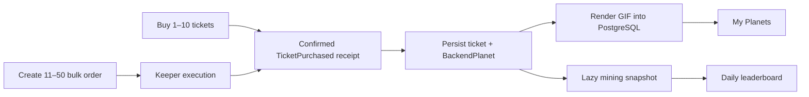

# Megastera

Megastera is a one-day hackathon MVP built around Megapot tickets on Base Sepolia.
Planets are deliberately backend records, not on-chain NFTs: a confirmed ticket receipt
creates one database row, the server renders a deterministic GIF, and My Planets displays
that row. Mining remains a read-only lifetime calculation.

## The demo loop



1. Connect a wallet to Base Sepolia.
2. Buy one to ten direct tickets or create an eleven-to-fifty keeper order.
3. After the execution receipt is finalized, the frontend sends its transaction hash and
   log index to the backend.
4. The backend verifies the canonical `MEGAPLANETS_V1` `TicketPurchased` event, persists
   immutable ticket provenance, derives deterministic traits, and stores GIF bytes.
5. My Planets reads only ready backend rows. The same rows power lazy mining and the daily
   leaderboard.

There is no Planet contract call, mint button, voucher, Pinata/IPFS artifact, direct
ERC721A holdings read, or continuous indexer in the active MVP.

## Product rules

- Base Sepolia (`chainId 84532`) only.
- `MEGAPLANETS_V1` remains the Megapot source tag.
- Direct checkout supports one to ten tickets; bulk checkout supports eleven to fifty.
- Backend generation is idempotent on `originTxHash:logIndex` and rejects conflicting
  persisted provenance.
- Planet traits use the shared deterministic generator. GIF bytes and their hash are stored
  in `BackendPlanet`.
- Mining is `baseMineralsPerDay × elapsed time` with fixed-point integer arithmetic. The
  browser never writes mineral state.
- Public reads require no application auth; server secrets stay outside Vite env variables.

## Runtime boundaries

| Boundary | Responsibility |
| --- | --- |
| Megapot + Base RPC | Ticket purchase, receipt finality, and canonical event verification |
| Frontend | Wallet checkout, generation progress, backend collection, mining display |
| API + PostgreSQL | Ticket provenance, BackendPlanet rows, GIF bytes, mining, leaderboard |
| Planet generator | DOM-free deterministic traits and server/browser rendering support |

## API

See [`api/README.md`](api/README.md) for the full route surface. The important paths are:

- `POST /api/planets/generate` and `/generate/batch`
- `GET /api/planets?owner=...` and `/planets/:planetId/gif`
- `GET /api/wallets/:address/mining`
- `GET /api/leaderboard/current`

## Local development

Requirements: Node.js 22+, pnpm, and a Base Sepolia RPC URL for live receipt reads.

```bash
pnpm install
pnpm db:generate
pnpm db:validate
pnpm dev
pnpm api:server
pnpm api:leaderboard-worker
```

Backend generation requires `BASE_SEPOLIA_RPC_URL` and `DATABASE_URL`; optional RPC
failover uses `BASE_SEPOLIA_RPC_FALLBACK_URLS`. Keep `.env.local` and server secrets out
of git.

## Verification

```bash
pnpm lint
pnpm typecheck
pnpm test
pnpm build
pnpm db:generate
pnpm db:validate
pnpm --filter @megaplanets/planet-generator golden
```
