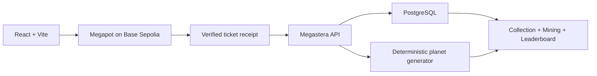

# Megastera

**Turn Megapot tickets into unique planets, build a collection, mine minerals, and compete on the leaderboard — while every expedition remains a real Megapot jackpot entry.**

Built for **Summer Game Jam 2026 — Megapot Track**.

## What is Megastera?

Megastera turns the Megapot lottery into a persistent exploration game.

Players explore the universe by purchasing real Megapot tickets. Each confirmed ticket becomes immutable provenance for a deterministic planet with unique visual traits. Discovered planets continuously produce minerals, collections grow over time, and players compete on a live leaderboard.

The lottery is not a link-out or side feature: buying a Megapot ticket is the action that advances the game.

## Gameplay loop


1. Connect a wallet on Base Sepolia.
2. Choose an expedition size and ticket coordinates.
3. Purchase Megapot tickets directly or through the bulk flow.
4. Megastera verifies the confirmed `TicketPurchased` receipt.
5. Each eligible ticket deterministically generates a planet.
6. Planets mine minerals over time and contribute to the collection leaderboard.
7. The same ticket remains a real entry in the Megapot jackpot.

## Why Megapot is core to the game

- **Every expedition is a Megapot purchase.** There is no separate game-only mint required to discover a planet.
- **Ticket provenance creates the planet.** A confirmed Megapot `TicketPurchased` event is verified before generation.
- **One action has two outcomes.** The player advances in Megastera while also participating in the Megapot jackpot.
- **Lottery history stays useful.** Ticket status and winnings remain visible alongside the game collection.
- **More exploration creates progression.** Additional planets expand the collection, mineral production, and leaderboard position.

## Game mechanics

### Planets

Each eligible Megapot ticket generates a deterministic planet. Its traits are derived from immutable ticket provenance, so the same input always resolves to the same world.

### Minerals

Ready planets produce minerals continuously from their generation time. Mining is calculated server-side with deterministic fixed-point arithmetic rather than mutable browser state.

### Collection strategy

Different planet types have different production characteristics, and same-type collection bonuses can increase mining output. Building the collection is therefore more than a visual inventory.

### Leaderboard

Wallets compete by mineral production. The leaderboard is calculated from the same verified planet records that power the collection.

### Jackpot

Every expedition still buys real Megapot tickets. Game progression never replaces the underlying lottery entry.

## Architecture



Key implementation properties:

- Base Sepolia (`chainId 84532`).
- `MEGASTERA` source tag for eligible Megapot tickets.
- Direct checkout for 1–10 tickets and a keeper-assisted bulk flow for 11–50.
- Canonical receipt verification before planet generation.
- Idempotent generation keyed by ticket provenance.
- Deterministic shared planet generator used across server and client rendering paths.
- Server-side PostgreSQL persistence through Prisma.
- Public read APIs; server secrets never enter the Vite client environment.

For implementation details, see [`docs/ARCHITECTURE.md`](docs/ARCHITECTURE.md) and [`api/README.md`](api/README.md).

## Tech stack

- React 19 + TypeScript
- Vite
- wagmi + viem + RainbowKit
- Megapot
- Base Sepolia
- PostgreSQL + Prisma
- Hono
- Vitest + Biome

## Local development

Requirements: Node.js 22+, pnpm, PostgreSQL, and a Base Sepolia RPC URL for live receipt reads.

```bash
pnpm install
pnpm db:generate
pnpm db:validate
pnpm dev
pnpm api:server
```

Copy the required values from [`.env.example`](.env.example) into your local environment. Backend generation requires `BASE_SEPOLIA_RPC_URL` and `DATABASE_URL`; optional RPC failover uses `BASE_SEPOLIA_RPC_FALLBACK_URLS`.

## Verification

```bash
pnpm lint
pnpm typecheck
pnpm test
pnpm build
pnpm db:generate
pnpm db:validate
pnpm --filter @megaplanets/planet-generator golden
```

## Hackathon & disclosure

Megastera was built for the **2026 Summer Game Jam — Megapot Track**.

The project integrates the Megapot protocol and was bootstrapped using Megapot developer resources and starter components. Megastera-specific gameplay, planet generation, mining, collection, leaderboard, backend verification, and presentation layers were developed for the project.

Third-party licenses and required attribution are preserved in the repository, including [`LICENSE`](LICENSE) and [`packages/planet-generator/THIRD_PARTY_NOTICES.md`](packages/planet-generator/THIRD_PARTY_NOTICES.md).
