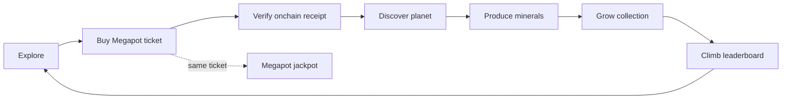
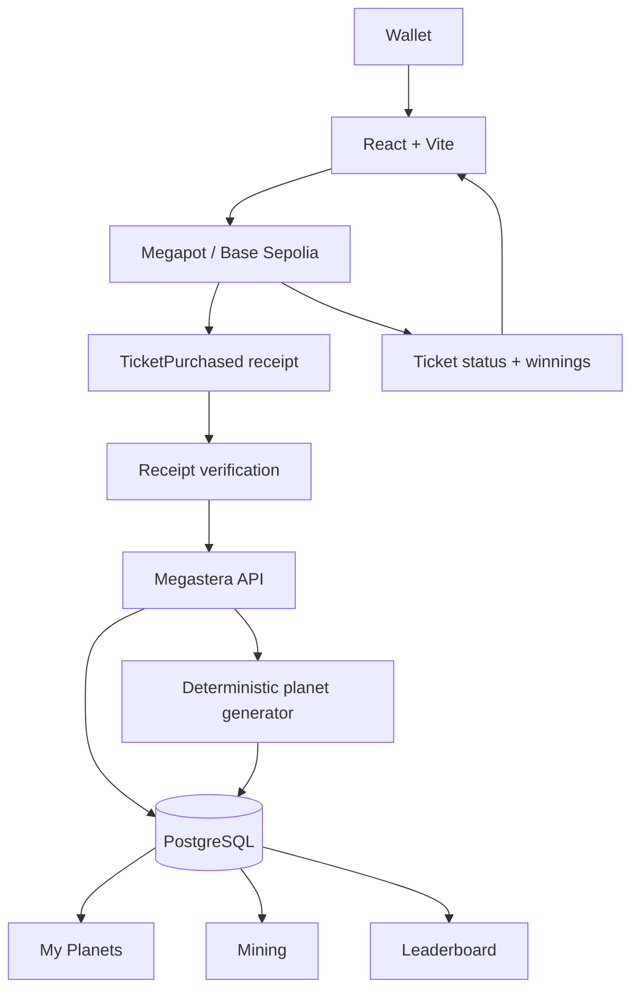

# Megastera

[](https://github.com/AstralEX1/megastera/actions/workflows/verify.yml)

**An onchain exploration game where Megapot tickets discover deterministic planets, planets produce minerals, and collections compete on a live leaderboard.**

Megastera turns a lottery ticket into persistent game progression. A player explores by purchasing a real Megapot ticket on Base Sepolia. Once the purchase is confirmed, Megastera verifies the onchain receipt and deterministically derives a planet from that ticket's provenance. The ticket remains a Megapot jackpot entry while the planet becomes part of the player's collection.

> **One purchase, two outcomes:** a Megapot jackpot entry and a permanent Megastera planet.

## At a glance

| | |
| --- | --- |
| **Network** | Base Sepolia (`84532`) |
| **Protocol** | Megapot |
| **Core action** | Purchase tickets to explore |
| **Game progression** | Discover planets → produce minerals → grow a collection → climb the leaderboard |
| **Planet provenance** | Verified `TicketPurchased` receipt |
| **Planet generation** | Deterministic, shared generator |
| **Persistence** | PostgreSQL + Prisma |

## The game loop



### 1. Explore
Connect a wallet and choose ticket coordinates. Small expeditions use direct checkout; larger all-random expeditions can use the bulk flow.

### 2. Buy a real Megapot ticket
The purchase happens through Megapot on Base Sepolia. Megastera does not use a separate game-only purchase to simulate the lottery interaction.

### 3. Verify the receipt
The backend verifies the canonical `TicketPurchased` event, chain, jackpot, source tag, receipt status, confirmation depth and block identity before accepting the ticket as planet provenance.

### 4. Discover a planet
Every eligible ticket purchased through Megastera maps to one deterministic planet. The same provenance always resolves to the same identity and traits.

### 5. Produce minerals
Ready planets produce minerals continuously from their backend generation timestamp. Mining is calculated from persisted planet data rather than mutable browser state.

### 6. Build a collection and compete
`My Planets` combines discovered planets with their ticket status and mining data. The leaderboard ranks wallets from the same verified planet records used by the collection.

### 7. Keep the jackpot exposure
The original Megapot ticket remains a real lottery entry. Megastera progression is layered on top of the ticket instead of replacing it.

## Why Megapot is part of the core loop

Megapot is not a link-out, optional widget, or cosmetic integration. It is the source of the action that creates game state.

- **Exploration requires a Megapot ticket.**
- **The ticket receipt is the planet's provenance.**
- **The same transaction advances both the game and the jackpot entry.**
- **Ticket lifecycle and winnings stay visible inside the product.**
- **Claimable Megapot winnings can be claimed from the connected experience.**

The result is a game where lottery participation produces a persistent collection rather than ending at the drawing.

## Gameplay systems

| System | What it does |
| --- | --- |
| **Exploration** | Turns ticket purchases into planet discovery attempts. |
| **Planets** | Deterministic worlds derived from verified ticket provenance. |
| **Traits** | Visual and production characteristics generated from the shared planet seed. |
| **Minerals** | Continuous resource production calculated from persisted planet data. |
| **Collection** | Gives each wallet a persistent inventory of discovered planets and pending tickets. |
| **Leaderboard** | Ranks wallets using live mining data derived from ready planets. |
| **Jackpot** | Preserves the underlying Megapot ticket, drawing status, winnings and claim flow. |

## What is implemented

- Wallet connection and Base Sepolia network flow.
- Megapot ticket selection and direct checkout.
- Keeper-assisted bulk purchases for larger all-random expeditions.
- Canonical receipt recovery and verification.
- Idempotent planet generation keyed by `originTxHash:logIndex`.
- Deterministic planet traits and GIF rendering.
- Persistent planet and ticket records in PostgreSQL.
- Retry-safe pending planet states while receipts reach finality or generation completes.
- `My Planets` collection with ticket provenance and status.
- Live mineral production.
- Wallet leaderboard.
- Megapot ticket history, drawing state and winnings.
- Onchain winnings claim flow after simulation.

## Architecture



### Trust boundaries

The browser is responsible for interaction, not authority. Server-side generation only accepts verified ticket provenance.

- The client never receives database credentials or server secrets.
- Receipt verification checks Base Sepolia and canonical event data before generation.
- Planet generation is idempotent: repeating the same valid request does not create a second planet.
- Conflicting persisted provenance fails closed.
- Generated GIF bytes are stored with an immutable content hash.
- Planet inventory is backed by database records derived from verified receipts, not by browser-local state.

Planets are persistent game records derived from onchain ticket provenance; discovering one does **not** require a second Planet NFT mint transaction.

For deeper implementation details, see [`docs/ARCHITECTURE.md`](docs/ARCHITECTURE.md), [`docs/OPERATIONS.md`](docs/OPERATIONS.md), and [`api/README.md`](api/README.md).

## Repository map

```text
megastera/
├── src/                       # React application and game UI
├── api/                       # Receipt verification, planet API, mining, leaderboard
├── packages/planet-generator # Shared deterministic planet generator
├── prisma/                    # Database schema and migrations
├── server/                    # Server runtime entry points
├── shared/                    # Shared types and utilities
├── public/                    # Brand assets and static files
├── docs/                      # Architecture, operations and safety notes
└── .github/workflows/         # Automated quality gate
```

## Tech stack

**Frontend:** React 19, TypeScript, Vite, wagmi, viem, RainbowKit  
**Protocol:** Megapot on Base Sepolia  
**Backend:** Hono, PostgreSQL, Prisma  
**Rendering:** shared deterministic planet generator  
**Quality:** Vitest, TypeScript, Biome, GitHub Actions

## Local development

Requirements:

- Node.js 22+
- pnpm 11+
- PostgreSQL
- Base Sepolia RPC URL for live receipt verification

```bash
pnpm install
pnpm db:generate
pnpm db:validate
pnpm api:server
pnpm dev
```

Copy the required values from [`.env.example`](.env.example) into your local environment before starting the frontend and API.

## Quality gate

The repository CI validates the application and deterministic generator on every pull request and on pushes to `main`.

```bash
pnpm lint
pnpm typecheck
pnpm test
pnpm --filter @megaplanets/planet-generator golden
pnpm build
pnpm db:generate
pnpm db:validate
```

## License and notices

See [`LICENSE`](LICENSE) for the repository license and [`packages/planet-generator/THIRD_PARTY_NOTICES.md`](packages/planet-generator/THIRD_PARTY_NOTICES.md) for bundled third-party attribution.
