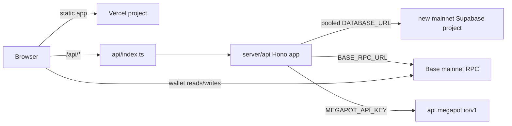

# Megastera architecture

This document describes the active Base mainnet backend-Planet runtime. Historical NFT and
testnet plans are not runtime requirements.

## Sources of truth

| Concern | Source of truth | Active consumer |
| --- | --- | --- |
| Ticket purchase and drawing state | Mainnet Megapot contracts + Base RPC | wagmi checkout |
| Ticket eligibility | Finalized mainnet receipt containing canonical `MEGASTERA` `TicketPurchased` | `server/api/receiptVerification.ts` |
| Historical status and winnings | Mainnet Megapot Data API via server proxy | `src/lib/api.ts` / `useWalletTickets` |
| Planet identity and media | Deterministic generator + `BackendPlanet` row | API and My Planets |
| Planet ownership | Verified receipt recipient persisted as `ownerAddress` | API list/mining routes |
| Mining | `baseMineralsPerDay` and `generatedAt` | `server/api/miningStore.ts` |
| Leaderboard | Ready BackendPlanet rows | Live route with an approximately 60-second process cache |

## Deployment topology



`vercel.json` rewrites every `/api/:path*` request to one function and encodes the original
path in `__path`. The entrypoint restores the public URL before handing it to Hono. The SPA
fallback excludes `/api`, preventing API 404s from returning `index.html`.

The Supabase runtime URL uses the transaction pooler. Each warm function instance creates
at most one PostgreSQL connection. Prisma migrations use `DIRECT_URL`, never the transaction
pooler. Supabase `anon` and `authenticated` roles are revoked from the backend schema by the
latest migration; the browser does not connect directly to Supabase.
The same migration also makes `ticket_purchases.normals` non-null, aligning a fresh
database created from migration history with the required Prisma field.

## Receipt-to-Planet flow

```text
Megapot execution receipt
  -> frontend receipt recovery and bounded retry
  -> Base chain ID + confirmation + canonical block verification
  -> canonical mainnet Jackpot + MEGASTERA event validation
  -> immutable TicketPurchase persistence
  -> deterministic BackendPlanet + GIF persistence
  -> collection / mining / leaderboard reads
```

Direct purchases support one to ten tickets. Eleven to fifty all-random tickets use the
mainnet batch facilitator. Each keeper execution receipt is processed separately; the
order-creation transaction is never Planet provenance. `originTxHash:logIndex` is the
idempotency key.

There is deliberately no deployment boundary block: any canonical Base mainnet
`MEGASTERA` purchase is eligible. Incorrect chain, jackpot, source, event fields, receipt
block, or optional recipient fails closed.

## Runtime surfaces

`server/api/index.ts` mounts backend Planet generation/collection/GIF/mining, leaderboard,
health/metrics, and the mainnet Megapot Data API proxy. `api/index.ts` is only the Vercel
adapter. `vite.config.ts` mounts the same Hono app in local development.

The frontend reads the current drawing dynamically from the Jackpot contract. It does not
hardcode ticket price, drawing ID, ball limits, referral rates, or lifecycle state. Claims
use `Jackpot.claimWinnings` after simulation. No active module signs vouchers, pins media,
reads a Planet contract, projects NFT events, or maintains an accrual ledger.

Legacy Prisma tables and migrations remain for database compatibility but are not imported
by active API/frontend paths.
